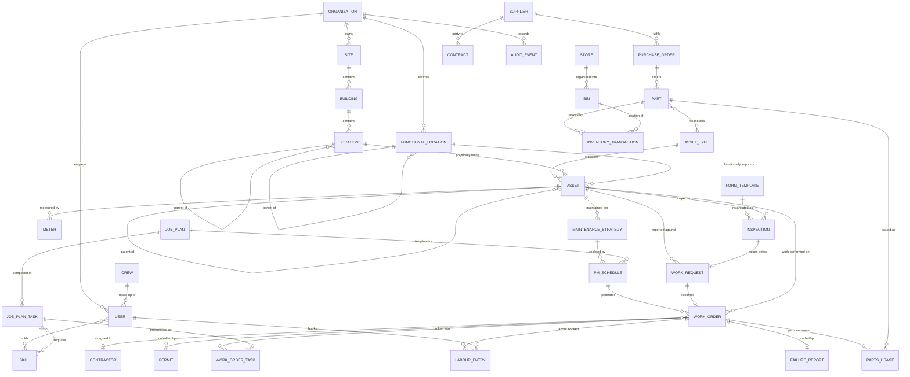
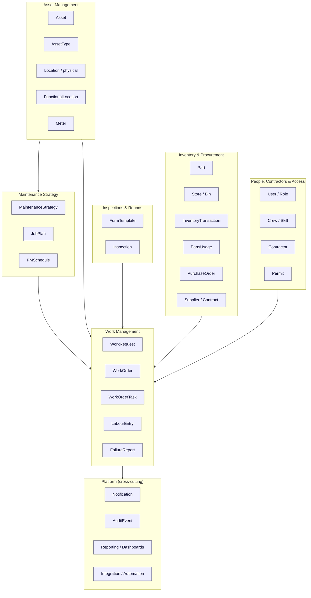

# 02 — Domain Model

This document defines the core entities of Plantree, how they relate, and how
they group into bounded contexts. Attribute-level detail lives in the
[data dictionary](03-data-dictionary.md); this is the shape of the domain.

## The spine

```
Asset ──has──▶ Maintenance strategy ──generates──▶ Work order ──consumes──▶ Labour · Parts · Cost
  ▲                                                     │
  └──────────────── writes back to ───── Asset history & performance ◀───────┘
```

Read it as a loop, not a line. Strategy and faults produce work; work consumes
resources; consumption and outcomes become history; history informs the next
strategy decision. Every other module attaches to a point on this loop.

## Core entities at a glance

| Entity | One-line purpose |
|--------|------------------|
| `Organization` | The tenant. Top of every ownership and access boundary. |
| `Site` / `Building` / `Location` | The **physical** hierarchy — where an asset physically is. |
| `FunctionalLocation` | The **functional / system** hierarchy — what service an asset supports. |
| `Asset` | A maintainable thing. Belongs to one physical location and (optionally) one functional location; may nest under a parent asset. |
| `AssetType` | Classification / model class; carries default attributes and expected life. |
| `Meter` | A counter or measurement on an asset (runtime hours, cycles, throughput). |
| `MaintenanceStrategy` | The intent for how an asset is maintained; the parent of its PM schedules. |
| `JobPlan` | A reusable, versioned template of tasks, labour, parts and safety for a piece of work. |
| `PMSchedule` | A trigger (time / meter / event / condition) that generates work from a job plan. |
| `WorkRequest` | A reported need for work, before it becomes (or is rejected as) a work order. |
| `WorkOrder` | The unit of executable, costable work. The operational heart of the system. |
| `WorkOrderTask` | A step / checklist item on a work order, instantiated from a job-plan task. |
| `LabourEntry` | Time booked against a work order by a person or crew. |
| `PartsUsage` | Parts reserved for and consumed by a work order. |
| `FailureReport` | Failure / cause / remedy coding captured against a work order. |
| `Inspection` | A completed digital form / round against an asset or location. |
| `FormTemplate` | A versioned definition of an inspection or round form. |
| `Part` | A stock-keeping item in the parts catalogue. |
| `Store` / `Bin` | Stocking locations. |
| `InventoryTransaction` | Any movement of stock (issue, return, transfer, adjust, receipt). |
| `Supplier` | A vendor of parts or services. |
| `PurchaseOrder` | A managed procurement document, handed to ERP for the financial side. |
| `Contract` | A service agreement or warranty with expiry and value tracking. |
| `Contractor` | An external party performing work, with compliance records. |
| `Permit` | Permit-to-work / isolation / LOTO record attached to work. |
| `User` / `Role` / `Team` / `Crew` | People, what they can do, and how they are grouped for scheduling. |
| `Skill` | A competency, licence or certification a person holds and a task may require. |
| `Notification` | A message generated by a rule and delivered on a channel. |
| `AuditEvent` | An immutable record of a change, for governance and history. |

## Entity-relationship diagram

The diagram below is the canonical map of the core domain. It is intentionally
scoped to the MVP + near-term entities; reliability and predictive entities are
described in [modules](04-modules.md) and added as those releases land.



### Notes on key relationships

- **Dual hierarchy.** `Asset` has a mandatory link to a physical `Location` and
  an optional link to a `FunctionalLocation`. The two hierarchies are entirely
  independent trees. This is the single most important structural decision in
  the model — it is why "a UPS in Electrical Room 2 supporting Power Train A" is
  a first-class fact rather than a workaround.
- **Request vs work order.** A `WorkRequest` is *demand*; a `WorkOrder` is
  *committed work*. Not every request becomes an order (some are rejected or
  merged), so the relationship is optional-to-one. Keeping them distinct lets
  requesters and planners have clean, separate experiences.
- **Job plan vs PM schedule.** A `JobPlan` is the reusable *content* (tasks,
  estimated labour, parts, safety). A `PMSchedule` is the *trigger* that says
  when to spawn a work order from that content. One job plan feeds many
  schedules and many one-off work orders.
- **Versioning.** `JobPlan`, `JobPlanTask` and `FormTemplate` are
  version-controlled. A `WorkOrder`/`Inspection` records the specific version it
  was created from, so historical work always shows the instructions that
  actually applied. See [data dictionary](03-data-dictionary.md#versioning).
- **Cost is derived, not a table.** There is no single "cost" entity. Cost rolls
  up from `LabourEntry` (hours × rate), `PartsUsage` (quantity × price) and
  contractor/PO charges. Asset cost history is an aggregation over these against
  the asset, not a stored figure.

## Bounded contexts

The entities cluster into contexts. These are the seams for module ownership,
API grouping and (eventually) service boundaries — not necessarily separate
deployables, but coherent areas of responsibility.



Reliability & Asset-Performance management (FMEA, RCA, health scores, predictive)
is a further context that reads heavily from Work, Assets and Inventory; it is
introduced in Release 4 (see [roadmap](08-roadmap.md)) and deliberately omitted
from the core diagram to keep the MVP model honest.
