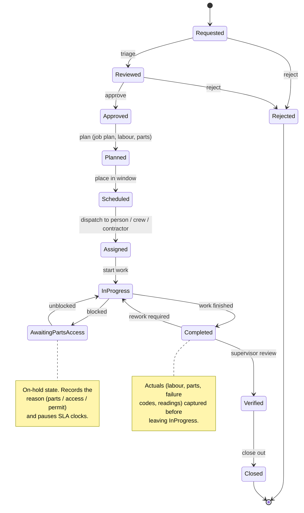

# 05 — Work Management Lifecycle

Work management is the operational heart of Plantree. This document defines the
default work-order lifecycle, the rules that govern transitions, and how the
lifecycle stays configurable without losing coherence.

## The default workflow

The concept specifies this sensible default sequence:

```
Requested → Reviewed → Approved → Planned → Scheduled → Assigned →
In progress → Awaiting parts/access → Completed → Verified → Closed
```

Plantree ships this as the out-of-the-box workflow. It is **configurable** (see
[configurability](#configurability)), but a small team can adopt the default on
day one without touching configuration.

## State machine



### PM-generated vs requested work

Work reaches the machine two ways:

- **From a `WorkRequest`** — enters at **Requested** and goes through review/
  approval, because demand needs triage.
- **From a `MaintenanceSchedule`** — the strategy is already approved, so
  generated work can enter directly at **Planned** (or **Scheduled** if a window
  is implied), skipping request/review. The provenance (`scheduleId`) and the
  [content snapshot](10-maintenance-strategy-application.md#the-work-order-snapshot)
  are retained.

This is why the model separates `WorkRequest` from `WorkOrder`: the two entry
paths have genuinely different front ends.

*When* schedule-generated work appears depends on deployment: with a server it is
generated on a timer; in the [serverless, file-based deployment](12-deployment.md)
it is generated **lazily when a user opens the app**, using a per-schedule
high-water mark to stay idempotent.

## Transition rules

The default configuration enforces these guards. All are overridable per
organisation, but they encode good practice.

| Transition | Guard / effect |
|-----------|----------------|
| → Approved | Requires approver role; may require within approval limit for cost. |
| Approved → Planned | A job plan (or ad-hoc tasks) and a labour estimate should exist. |
| Planned → Scheduled | Parts reserved (`PartsUsage.reservedQty`) and a window/date set. |
| Scheduled → Assigned | Assignee must hold the skills the tasks require. |
| Assigned → InProgress | Any required `Permit` must be issued; asset status must permit work. |
| → AwaitingPartsAccess | Reason mandatory; pauses due/SLA clocks; may fire a parts-availability watcher. |
| InProgress → Completed | Actual labour, consumed parts, task responses, and (R2) failure codes captured. |
| Completed → Verified | Supervisor/reviewer role; may create follow-up work orders. |
| Verified → Closed | Immutable close-out; asset history & cost roll-up finalised; stock deducted. |
| any → Rejected | Requester notified; reason recorded. Terminal. |

### Effects on the rest of the system

- **Reserve-then-consume.** Parts are *reserved* at **Scheduled** and *deducted*
  (via `InventoryTransaction` type `issue`) at or before **Completed** — never
  earlier. This keeps available-stock figures honest.
- **Cost roll-up.** Labour (hours × rate), parts (qty × price) and contractor/PO
  charges accrue against the work order and, through it, the asset. Asset cost
  history is the aggregation of closed work orders.
- **History & audit.** Every transition writes an `AuditEvent`. The work order,
  its pinned job-plan version, task responses and failure codes become permanent
  asset history at **Closed**.
- **Follow-up work.** Rework loops back to **InProgress**; genuinely new work
  discovered during execution is raised as a *new* work order (optionally linked
  via `parentWorkOrderId`), not bolted onto the closed one.

## Priority, criticality & due dates

- **Priority** is set on the request (suggested) and confirmed on the work order
  (authoritative). It combines with asset **criticality** to drive scheduling
  order and escalation.
- **Due date** derives from priority + a configurable response/resolution target
  (SLA). Overdue work is a first-class dashboard and notification trigger.
- Time in **AwaitingPartsAccess** pauses the SLA clock so teams aren't penalised
  for waiting on parts or access outside their control.

## Configurability

The workflow engine treats the lifecycle as data, not code. The full model —
states, first-class transitions, triggers (manual / on-entry / timer / condition),
the guard expression language, and how automatic transitions fire lazily — is in
[workflow configuration](13-workflow-configuration.md). In brief:

- **States** and their order are configurable per organisation (and optionally
  per work-order type — a [`WorkOrderType`](03-data-dictionary.md#workordertype)
  can name a `workflowProfile` so, e.g., reactive breakdowns keep the full path
  while administrative work skips review/approval). The seeded types are
  `PM` (preventative), `RM` (reactive), `AD` (administrative) and `OP` (operations);
  the catalogue is extensible.
- **Transitions** carry configurable guards (role, approval limit, required
  fields) and **actions** (notify, create follow-up, reserve parts, fire
  webhook, run a no-code automation rule).
- **The default profile above is a seed**, not a hard-coded path. Removing the
  review/approval steps for a low-criticality corrective flow, or adding a
  "Parked" backlog state, is configuration — not a code change.

The guarantee: however the states are configured, every work order carries a
complete, audited transition history, and closed work is immutable.
