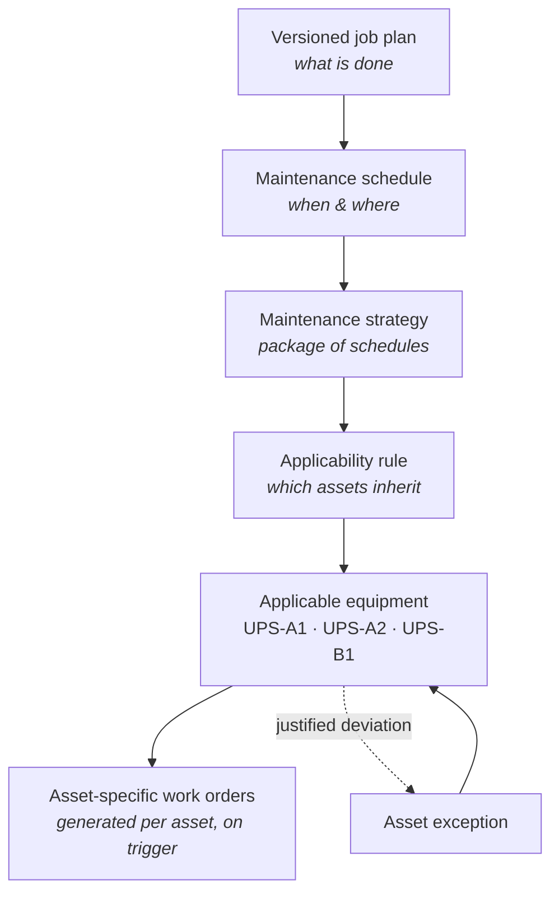
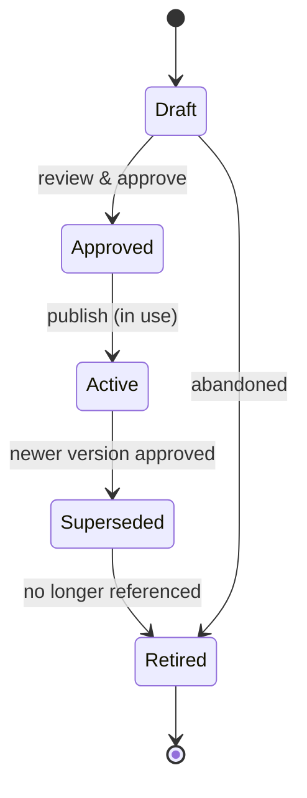

# 10 — Maintenance Strategy Application

How maintenance plans reach assets. This is one of the highest-leverage design
decisions in a CMMS: get it wrong and every new asset means manually re-attaching
plans, every procedure change means editing hundreds of records, and audits
become guesswork. Get it right and maintenance is defined once, applied by rule,
and materialised into work orders only when needed.

> **Guiding principle:** maintain the job plan once, assign it through rules, and
> generate asset-specific work orders only when required.

This document refines the [domain model](02-domain-model.md) and
[data dictionary](03-data-dictionary.md); read those for the entity shapes. Here
we cover *how the objects combine* to apply maintenance at scale.

## The anti-pattern to avoid

Copying a job plan (or a schedule) onto every equipment record. It feels simple
on day one, then becomes very hard to update, audit and keep consistent: 40
near-identical copies drift apart, a procedure change touches 40 records, and no
one can tell which assets are actually covered. **Plantree never copies plans to
assets.** Assets *inherit* strategies through rules; the plan stays single-source.

## The application chain



Worked example:

- **Job plan:** *Quarterly UPS Inspection* (the tasks, readings, parts, safety).
- **Maintenance strategy:** *Standard UPS Maintenance* (the package it belongs to).
- **Applicable class:** UPS.
- **Optional model rule:** Manufacturer = Schneider, Model = Galaxy VX.
- **Assets automatically covered:** UPS-A1, UPS-A2, UPS-B1.
- **Work orders:** generated individually per applicable UPS on each trigger.

## Separate the plan from the schedule

A common design mistake is combining *what is done* and *how often* in one record.
Plantree keeps them apart so one plan serves many frequencies.

| Job plan — **what** is done | Maintenance schedule — **when & where** |
|-----------------------------|------------------------------------------|
| Tasks and sequence | Applicable equipment |
| Labour and skill requirements | Frequency |
| Estimated duration | Calendar or meter trigger |
| Parts and tools | Lead time |
| Readings and acceptable ranges | Seasonal window |
| Safety controls | Maintenance window |
| Required documents | Responsible team |
| Completion / sign-off requirements | Work-order priority |

The payoff: the *same* job plan runs **quarterly at Site A and six-monthly at
Site B** without duplicating the plan. Change the procedure once; every schedule
that references it picks up the new approved version.

## Strategy = a package of schedules

A **maintenance strategy** bundles the related schedules for a class of
equipment, so commissioning an asset applies a whole programme in one action.

*Standby Generator – Standard Strategy:*

| Schedule | Job plan | Trigger |
|----------|----------|---------|
| Weekly | Visual generator inspection | Every 7 days |
| Monthly | Generator test run | Every month |
| Six-monthly | Generator service | Every 6 months |
| Annual | Full-load test | Every 12 months |
| Runtime | Oil & filter replacement | Every 250 hours |

Assigning *Standby Generator – Standard Strategy* to a newly commissioned
generator applies all five schedules at once — far easier to maintain than
attaching five plans to every new unit by hand.

## Apply at the highest sensible level; override downward

An asset inherits the **most specific applicable strategy**, with more specific
levels overriding more general ones.

| Application level | Best use |
|-------------------|----------|
| **Asset class** | Generic work applying to all chillers / UPSs / generators |
| **Asset subtype** | Different plans for rotary vs static UPS |
| **Manufacturer / model** | Manufacturer-specific procedures |
| **Site / operating environment** | Different frequencies or requirements by site |
| **Individual asset** | Genuine one-off equipment exceptions |
| **Work order** | Temporary variation for that one occurrence |

Two non-negotiable behaviours:

1. **Most-specific wins.** Resolution walks from class → subtype → model → site →
   asset → work order, with the narrowest match taking precedence.
2. **The system explains *why*.** For any asset, Plantree can show which strategy
   applies and the rule that put it there — e.g. *"UPS-A2 inherits Standard UPS
   Strategy via class = UPS, overridden at model level for Galaxy VX."*
   Explainability is a first-class feature, not a debug aid: it makes maintenance
   reviews safe.

## Handle variations as parameters first

Before creating another job plan, ask whether the difference is just **data**. A
generic breaker-test plan can carry parameters resolved from the asset record or
model template:

- Operating voltage · breaker rating · required injection current · acceptable
  trip time · applicable test standard.

One parameterised plan is far easier to govern than 40 nearly identical copies.
**Create a separate plan only when the actual procedure, safety controls,
competencies or task sequence materially differ** — not for value differences a
parameter can express.

## Exceptions, not copies

Real equipment has genuine one-offs: a different frequency, an extra task, a task
excluded, a different responsible team, a temporary suspension, a
manufacturer-specific procedure. Record these as a **visible exception to the
inherited strategy** — never by copying the whole strategy onto the asset and
breaking inheritance.

> UPS-A2 inherits *Standard UPS Strategy*, with one exception: battery-impedance
> testing every three months instead of six.

The asset still tracks the parent strategy, so when the strategy improves, the
asset benefits — except where a deliberate, documented exception overrides it.
That is what keeps future maintenance reviews safe.

## Routes for many-asset inspections

For simple inspections spanning many assets, use a **route** rather than
generating a flood of separate work orders:

- One weekly plant-room inspection work order.
- A route of, say, 20 CRAH units.
- A repeated checklist per unit; individual readings and defects recorded against
  each asset.

Use **individual** work orders instead when each asset needs its own planning,
isolation, downtime, cost capture or compliance evidence. The choice is per
schedule.

## Automatic applicability at fleet scale

For larger fleets, applicability is a **rule over asset attributes**, evaluated
continuously:

```
Asset class   = CRAH
AND status    = Operating
AND criticality >= 3
AND manufacturer = Stulz
AND site      = SYD1
```

Assets **entering or leaving** the rule automatically gain or lose the strategy —
subject to approval or a preview step. Before a rule change is committed,
Plantree shows an **impact preview**:

> This change will add the six-monthly EC-fan inspection to **84 operating
> assets** and generate **12 work orders within the next 30 days**.

No silent fleet-wide change: the person making it sees the blast radius first.

## Versioning — never silently alter history

Job plans move through a controlled lifecycle:

```
Draft → Approved → Active → Superseded → Retired
```



The rules when a plan changes:

- **Future work** uses the new **Active** version.
- **Open work** either retains its original version or is *deliberately* upgraded
  — never silently.
- **Completed work permanently retains the version actually performed.**

Storing only a live reference — so an old work order appears to have followed the
current procedure — is exactly the failure mode to avoid. This is enforced by the
work-order snapshot (below).

## The work-order snapshot

When a schedule generates a work order, Plantree **snapshots** the applicable
content onto the work order: the pinned job-plan version, the resolved parameter
values (from asset/model), the tasks, readings and acceptance criteria, and any
active exception. The generated work order also takes the plan's
[`workOrderTypeCode`](03-data-dictionary.md#jobplan-versioned), so a plan raising
administrative or operations work is classified correctly rather than defaulting
to preventive. The snapshot is what the technician executes and what history
retains.

Consequently:

- History is truthful even after the plan, parameters or strategy later change.
- Audits can reconstruct exactly what was issued and what was performed.
- The live strategy stays editable without corrupting the record of past work.

## The six core objects

Everything above reduces to six objects — the recommended model:

| # | Object | Responsibility |
|---|--------|----------------|
| 1 | **Job plan** | Reusable, version-controlled instructions (*what*). |
| 2 | **Maintenance schedule** | Frequency, trigger and planning settings (*when & where*). |
| 3 | **Maintenance strategy** | A collection of related schedules for a class. |
| 4 | **Applicability rule** | Determines which assets inherit the strategy. |
| 5 | **Asset exception** | Records justified deviations from the inherited strategy. |
| 6 | **Work-order snapshot** | Preserves what was actually issued and performed. |

Together these give **centralised maintenance with enough flexibility for real
equipment differences** — the balance a good CMMS has to strike. The one rule
that must never be broken: *do not copy job plans or schedules onto every
equipment record.*

## How this maps onto the rest of the architecture

- **Entities** — objects 1–5 are in the [domain model](02-domain-model.md) and
  [data dictionary](03-data-dictionary.md); object 6 (snapshot) is the mechanism
  behind the [versioning guarantee](03-data-dictionary.md#versioning) and the
  work-order [`jobPlanVersion` pin](05-work-management-lifecycle.md).
- **Generation** — schedules generate work orders that enter the
  [work lifecycle](05-work-management-lifecycle.md); PM-generated work can skip
  request/review because the strategy is already approved.
- **API** — strategies, schedules, applicability rules (with impact **preview**)
  and exceptions are resources in the [API surface](06-api-surface.md); rule
  evaluation and preview are explicit endpoints.
- **Governance** — rule changes are approvable and audited; the impact preview is
  part of the [administration & governance](07-cross-cutting-concerns.md#administration--governance)
  posture.
